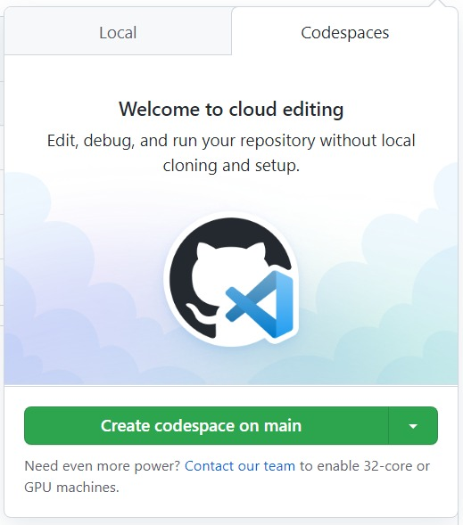

# C++ example with codespaces & classrooms

You can run this C++/Xeus example live via a GitHub codespaces window by doing the following:

1. Click on the Code button above
  
2. Select the "Codespaces" tab, and then click the "Create Codespaces on Main" button.
  

It might take up to 10 minutes for the codespace to be created the first time you start it. Once the image has been created, it should relaunch fairly fast.